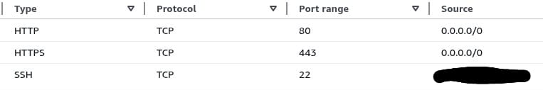

<h1 align="center">
	✏️ Cloud-1
</h1>

 
Esse projeto visa ampliar seu conhecimento em administração de sistemas e automação de deployments.

	
	
	

---

<h2>📦 Sobre o projeto</h2>

> __There is no cloud it’s just someone else’s computer_

Esse projeto visa a automação de um processo de deploy de um serviço/aplicação em um servidor remoto. Para isso vamos precisar de:
	<ul>
		<li>
			Um <b>servidor remoto</b> provisionado em alguma cloud. Para esse projeto usarei um EC2 na AWS	
		</li>
		<li>
			Uma <b>ferramenta de automação</b> para o processo de deploy. Aqui eu escolhi o Ansible, recomendado pelo subject do projeto.
		</li>
		<li>
			Uma <b>aplicação</b> para validar o processo de deploy. Será um Site WordPress.
		</li>
	</ul>

<h3>Primeiros Passos</h3>
Para começar a trabalhar nesse projeto, precisamos primeiro de um servidor remoto, com ip público e ssh habilitado. 
Aproveitando o embalo da automação, fiz o provisionamento do EC2 via Terraform para facilitar o processo de provisionamento toda vez que eu voltasse a trabalhar no projeto. Esse passo é opicional, tendo em vista que também é permitido provisionar o servidor manualmente via console ou CLI.

<h4>Provisionando Servidor na AWS</h4>

Por não ser o foco do projeto, escolhi a abordagem mais simples de criar os recursos que eu precisava para acessar o servidor na própria console da AWS e automatizar apenas a subida do servidor, passando os recursos como parâmetros.

Como iremos fazer o deploy de um site em um servidor remoto, precisamos que a instância tenha acesso HTTP/HTTPS permitido. Além disso, precisaremos do acesso via SSH para o deploy através do Ansible. Para isso é necessária a criação de um security group com as regras necessárias.

Para o <b>acesso via SSH</b> também precisaremos de um par de chaves. Criei pela console e passei para a instância no campo key_name no main.tf.

As regras ficaram assim:
<ul>
	<li>Aceita HTTP e HTTPS de qualquer lugar</li>
	<li>Aceita SSH da minha máquina pessoal (da máquina que o Ansible irá rodar)</li>
	<li>Aceita qualquer tráfego pra fora da instância</li>
</ul>

